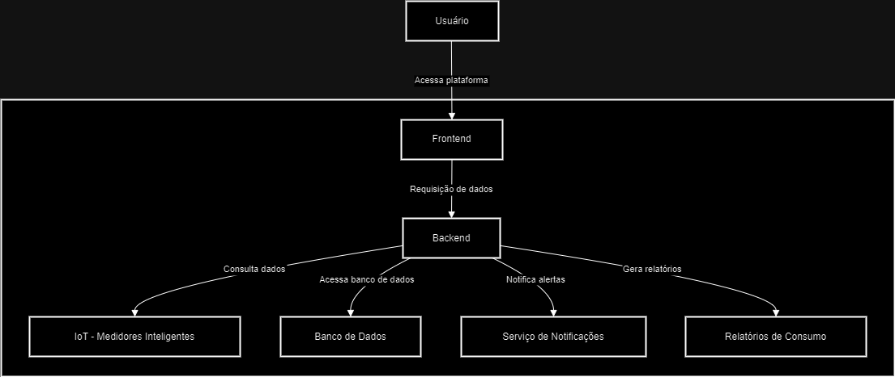
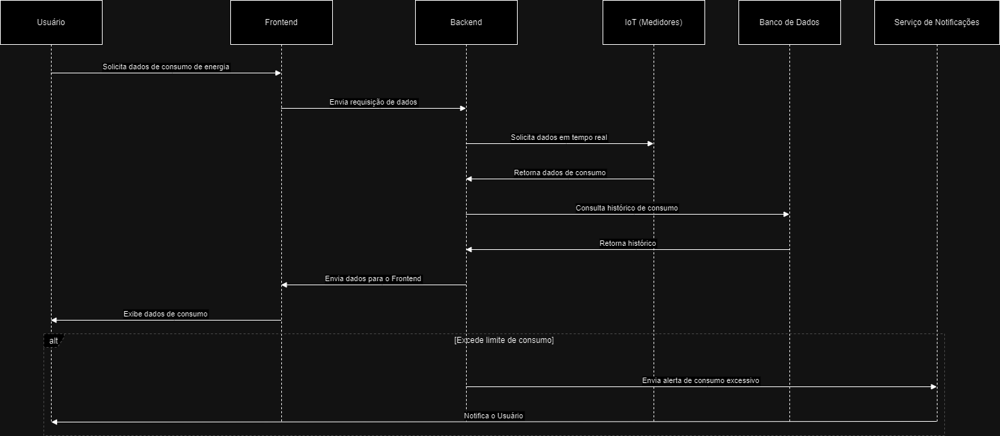
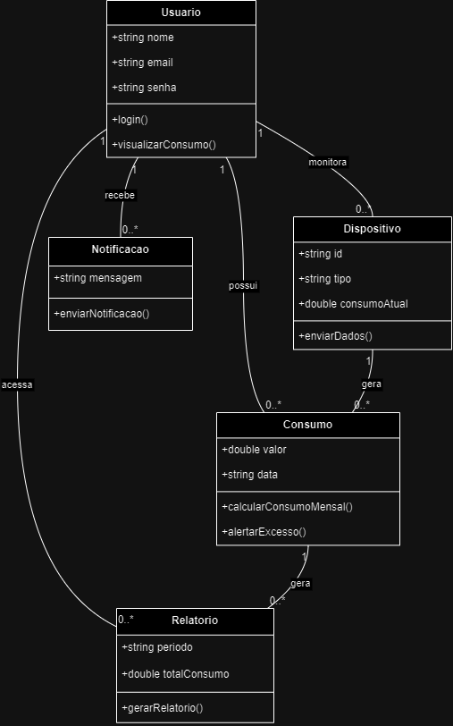

# **Descrição Geral**   
O sistema será uma **Plataforma de Gerenciamento de Energia Sustentável**, integrando dispositivos IoT, como medidores inteligentes, para monitorar, analisar e otimizar o consumo de energia elétrica em residências e empresas.  

O principal objetivo é oferecer ferramentas práticas para promover o uso eficiente de energia, reduzir desperdícios e incentivar práticas sustentáveis.  

---

## **Características Principais do Sistema**  

### 1. **Monitoramento em Tempo Real**  
- Captura e apresenta dados de consumo energético diretamente dos dispositivos IoT conectados.  

### 2. **Relatórios Personalizados**  
- Gera relatórios detalhados com visualizações claras, como gráficos e tabelas, permitindo:  
  - Comparação de consumo em diferentes períodos.  
  - Identificação de padrões e picos de uso.  
  - Informações acionáveis para reduzir desperdícios.  

### 3. **Sistema de Recomendação**  
- Sugere melhorias com base em dados históricos e padrões detectados no consumo energético.  

### 4. **Definição de Metas**  
- Permite aos usuários configurarem objetivos de redução de consumo e acompanhar o progresso.  

### 5. **Alertas Automatizados**  
- Envia notificações em tempo real, alertando sobre consumo excessivo ou desvios de metas configuradas.  

### 6. **Gestão de Dispositivos IoT**  
- Facilita a adição, configuração e monitoramento dos dispositivos conectados na plataforma.  

# Requisitos Funcionais e Não Funcionais

---

## Funcionais

### 1. Monitoramento em Tempo Real
O sistema precisa ser capaz de coletar e mostrar os dados de consumo de energia de dispositivos IoT conectados, como medidores inteligentes e sensores. Esses dados precisam ser atualizados em tempo real, então o usuário vai ver o consumo de energia à medida que ele acontece.

### 2. Relatórios Personalizados
O sistema vai gerar relatórios detalhados, onde o usuário pode ver o consumo de energia de diferentes dispositivos e em diferentes períodos (diário, semanal, mensal). Além disso, o sistema deve gerar gráficos para ajudar na visualização desses dados e ainda dar recomendações sobre o que pode ser feito para melhorar o consumo.

### 3. Sistema de Recomendação
Com base no histórico de consumo, o sistema vai sugerir algumas ações para ajudar a reduzir o consumo de energia. Exemplos de recomendações: "diminuir o uso de iluminação durante a noite" ou "trocar aparelhos antigos por mais eficientes".

### 4. Definição de Metas
O sistema vai permitir que o usuário defina metas, como, por exemplo, reduzir 10% do consumo nos próximos três meses. O sistema vai acompanhar essas metas e mostrar se o usuário está conseguindo alcançá-las.

### 5. Alertas Automatizados
Quando o consumo de energia ultrapassar certos limites ou se houver picos de consumo inesperados, o sistema vai mandar um alerta para o usuário. Isso ajuda a evitar desperdício de energia.

### 6. Gestão de Dispositivos IoT
O usuário vai poder adicionar, configurar e monitorar os dispositivos IoT conectados de uma forma simples e fácil. O sistema também precisa ser compatível com novos dispositivos que possam aparecer no futuro.

---

## Não Funcionais

### 1. Escalabilidade
O sistema precisa ser escalável, ou seja, ele precisa conseguir lidar com o aumento de usuários e de dados sem perder a performance. Isso é importante porque a quantidade de dispositivos IoT vai crescer com o tempo.

### 2. Desempenho
O sistema precisa ser rápido. Quando o usuário pedir informações ou gerar relatórios, o sistema deve responder de forma rápida e sem demora. Isso é crucial para garantir uma boa experiência para o usuário.

### 3. Segurança
A segurança dos dados é muito importante. O sistema vai lidar com informações pessoais dos usuários e dados sensíveis de consumo. Por isso, as comunicações precisam ser criptografadas e o sistema deve seguir as leis de proteção de dados, como a LGPD.

### 4. Manutenibilidade
A arquitetura do sistema precisa ser bem estruturada e modular para facilitar manutenções e futuras atualizações. Se no futuro forem necessários novos dispositivos ou funcionalidades, o sistema deve ser fácil de expandir sem causar problemas.

## 2.2. Escolha da Arquitetura

A arquitetura de **microservices** foi escolhida para o sistema de gerenciamento de energia sustentável porque ela oferece várias vantagens, como **escalabilidade**, **flexibilidade** e **facilidade de manutenção**.

### Escalabilidade
Cada microservice funciona de forma independente, o que significa que podemos **escalar partes específicas** do sistema quando a demanda aumenta, sem precisar expandir todo o sistema de uma vez. Isso é super importante porque com o tempo o número de dispositivos IoT vai crescer e a quantidade de usuários também. Assim, podemos ajustar o sistema sem sobrecarregar tudo.

### Flexibilidade
Como os microservices são serviços pequenos e independentes, eles **podem ser atualizados ou modificados** sem afetar todo o sistema. Se precisarmos adicionar novas funcionalidades ou integrar novos dispositivos IoT, podemos fazer isso com mais facilidade.

### Manutenção
A arquitetura de microservices também facilita a **manutenção** do sistema, pois cada serviço é isolado. Se algo der errado com um serviço, não vai afetar os outros, e as atualizações podem ser feitas de forma mais rápida e sem interrupções. Isso torna o sistema mais confiável a longo prazo.

### Segurança
Além disso, cada microservice pode ter seus próprios **controles de acesso**, o que aumenta a **segurança**. Isso ajuda a proteger os dados dos usuários e as informações de consumo de energia, já que diferentes partes do sistema podem ter diferentes níveis de acesso.

### Resumo
Em resumo, a arquitetura de microservices atende às necessidades do sistema por ser escalável, flexível e segura. Ela facilita a integração com novos dispositivos IoT e garante que o sistema possa evoluir ao longo do tempo sem causar grandes problemas ou interrupções.

## 3. Diagramas

### Diagrama de Componentes
O **Diagrama de Componentes** mostra como as partes principais do sistema estão conectadas. Ele inclui os seguintes componentes:

- **Frontend**: É a interface do usuário, ou seja, o que as pessoas veem e interagem ao usar a plataforma. O Frontend envia as solicitações para o Backend.
- **Backend**: É o "cérebro" do sistema, onde os dados são processados e gerenciados. O Backend se comunica com os dispositivos IoT, como os medidores inteligentes, para pegar os dados de consumo em tempo real. Ele também acessa o **Banco de Dados** para recuperar o histórico de consumo do usuário.
- **Dispositivos IoT**: São os medidores inteligentes e outros sensores conectados que fornecem os dados de consumo energético em tempo real.
- **Banco de Dados**: Armazena o histórico de consumo e outros dados importantes, como as configurações dos dispositivos e as metas do usuário.
- **Notificações**: Caso o consumo ultrapasse um limite definido, o Backend envia uma notificação para o **Usuário**.

Esse diagrama ajuda a visualizar como cada parte do sistema se conecta e trabalha em conjunto.

### Diagrama de Sequência

O **Diagrama de Sequência** descreve o passo a passo de como as ações acontecem no sistema, em ordem cronológica. O processo é o seguinte:

1. O **Usuário** acessa o **Frontend**, que é a interface que ele utiliza para interagir com o sistema.
2. O **Frontend** envia uma requisição para o **Backend** para buscar dados de consumo.
3. O **Backend** então consulta os **Dispositivos IoT** para obter os dados em tempo real de consumo de energia.
4. Em seguida, o **Backend** verifica o **Banco de Dados** para consultar o histórico de consumo.
5. Se o consumo ultrapassar o limite definido pelo usuário, o **Backend** envia uma **notificação** para o **Usuário**.

Esse diagrama deixa claro como as ações se conectam, desde o momento em que o usuário faz uma solicitação até o envio de alertas.

### Diagrama de Classes
O **Diagrama de Classes** ilustra as principais **entidades** do sistema e como elas se relacionam. As classes principais são:

- **Usuário**: O usuário do sistema, que pode acessar seus dados de consumo, visualizar relatórios e receber notificações quando o consumo ultrapassar os limites definidos por ele.
- **Consumo**: Representa os dados de consumo de energia, calculados com base nas leituras dos **Dispositivos IoT**.
- **Relatório**: Gera relatórios com base no histórico de consumo do usuário, para ajudá-lo a entender seus padrões de uso de energia.
- **Notificação**: Envia alertas ao **Usuário** caso o consumo ultrapasse os limites definidos por ele.

Essas classes estão interligadas de forma que cada uma desempenha um papel específico na gestão e processamento dos dados.

### Conclusão
Esses três diagramas — **Componentes**, **Sequência** e **Classes** — fornecem uma visão detalhada e clara de como o sistema funciona. Eles mostram desde a interação do usuário com o sistema até como os dados são coletados e processados, incluindo como as notificações são enviadas quando necessário.

### Sistema de Gerenciamento de Consumo de Energia

O sistema é dividido em várias classes que lidam com as funcionalidades principais, incluindo o gerenciamento do usuário, consumo de energia, dispositivos IoT, relatórios e notificações.

# Classe Usuario:
  # A classe Usuario é responsável por gerenciar as informações do usuário, incluindo dados pessoais e as metas de consumo de energia.
  Atributos:
    nome  # Nome do usuário
    email  # E-mail do usuário
    metas_de_consumo  # Definido pelo usuário para controlar o consumo de energia
    alertas  # Armazena os alertas enviados ao usuário

  Métodos:
    função cadastrarUsuario(nome, email):  # Registra o usuário no sistema com seu nome e e-mail.
      this.nome = nome
      this.email = email
      criarNotificação("Bem-vindo ao sistema de gerenciamento de energia!")

    função configurarMeta(consumo_ideal):  # Define a meta de consumo de energia do usuário.
      this.metas_de_consumo = consumo_ideal

    função receberAlerta(mensagem):  # Adiciona alertas à lista de alertas do usuário.
      this.alertas.adicionar(mensagem)

    função visualizarRelatorio():  # Gera um relatório com base no consumo do usuário.
      retorne Relatorio.gerarRelatorio(this.nome, this.metas_de_consumo)

   Descrição:
  A classe Usuario é fundamental porque permite que o usuário registre seus dados e defina metas de consumo de energia. 
  Ela também gerencia o envio de alertas caso o consumo ultrapasse os limites definidos. 
  Além disso, o usuário pode visualizar um relatório detalhado de seu consumo.

# Classe Consumo:
   A classe Consumo lida com o registro de consumo de energia. Ela verifica se o consumo ultrapassa a meta definida pelo usuário e envia alertas se necessário.
  Atributos:
    usuario  # O usuário associado ao consumo
    data  # Data em que o consumo foi registrado
    consumo_kWh  # O valor de consumo registrado em kWh

  Métodos:
    função registrarConsumo(usuario, consumo):  # Registra o consumo de energia do usuário.
      this.usuario = usuario
      this.data = obterDataAtual()  # Obtém a data atual
      this.consumo_kWh = consumo
      verificarLimiteConsumo(usuario)

    função calcularConsumoTotal():  # Calcula o total de consumo de energia.
      retorne this.consumo_kWh

    função verificarLimiteConsumo(usuario):  # Verifica se o consumo ultrapassa a meta do usuário.
      se this.consumo_kWh > usuario.metas_de_consumo:
        usuario.receberAlerta("Limite de consumo excedido!")

  # Descrição:
  # A classe Consumo é responsável por registrar e controlar o consumo de energia do usuário. Ela verifica automaticamente se 
  # o consumo ultrapassa a meta definida e, caso necessário, envia um alerta ao usuário. 

Classe DispositivoIoT:
  # A classe DispositivoIoT lida com dispositivos inteligentes de medição de energia. Ela registra dispositivos e mede o consumo de energia em tempo real.
  Atributos:
    id_dispositivo  # Identificação única do dispositivo
    tipo  # Tipo do dispositivo, como medidor de energia
    consumo_atual  # Consumo de energia atual medido pelo dispositivo

  Métodos:
    função registrarDispositivo(id, tipo):  # Registra um novo dispositivo no sistema.
      this.id_dispositivo = id
      this.tipo = tipo
      this.consumo_atual = 0  # Inicializa o consumo com valor zero

    função medirConsumo(consumo):  # Mede o consumo de energia e retorna o valor.
      this.consumo_atual = consumo
      retornar this.consumo_atual

  # Descrição:
  # A classe DispositivoIoT é responsável por integrar o sistema com dispositivos de medição de energia conectados via IoT. 
  # Ela coleta dados de consumo em tempo real e os envia para o sistema, ajudando a manter o controle preciso do uso de energia.

Classe Relatorio:
  # A classe Relatório gera relatórios detalhados sobre o consumo de energia. Ela também faz sugestões baseadas no consumo em relação às metas do usuário.
  Atributos:
    usuario  # Usuário associado ao relatório
    consumo_total  # Total de consumo de energia
    recomendacoes  # Recomendações de redução de consumo, se necessário

  Métodos:
    função gerarRelatorio(usuario, consumo_total):  # Gera o relatório completo com consumo e recomendações.
      this.usuario = usuario
      this.consumo_total = consumo_total
      calcularRecomendacoes()
      retornar "Relatório gerado com sucesso!"

    função calcularRecomendacoes():  # Calcula recomendações com base no consumo do usuário.
      se this.consumo_total > usuario.metas_de_consumo:
        this.recomendacoes.adicionar("Reduzir o uso de energia à noite.")
      senão:
        this.recomendacoes.adicionar("Continue com seu bom uso de energia!")

  # Descrição:
  # A classe Relatório tem como objetivo gerar relatórios detalhados sobre o consumo de energia do usuário. 
  # Caso o consumo tenha ultrapassado a meta, ela também oferece recomendações personalizadas para redução do consumo.

Classe Notificacao:
  # A classe Notificação envia alertas para o usuário, seja sobre o consumo de energia ou outras mensagens importantes relacionadas ao gerenciamento de energia.
  Atributos:
    usuario  # Usuário que receberá a notificação
    mensagem  # Mensagem a ser enviada ao usuário

  Métodos:
    função enviarNotificacao(usuario, mensagem):  # Envia uma notificação ao usuário com a mensagem fornecida.
      this.usuario = usuario
      this.mensagem = mensagem
      exibirNotificacaoNoApp(usuario, mensagem)

    função exibirNotificacaoNoApp(usuario, mensagem):  # Exibe a notificação no aplicativo do usuário.
      mostrarNaTela(usuario.nome, mensagem)

  # Descrição:
  # A classe Notificação é responsável por enviar mensagens e alertas ao usuário, alertando-o sobre eventos importantes, como 
  # o ultrapassamento da meta de consumo. Ela garante que o usuário seja sempre informado sobre o status de seu consumo de energia.

## Estratégia de Escalabilidade

Para garantir que a nossa plataforma consiga crescer e se adaptar conforme mais gente começa a usar, precisamos de uma estratégia de escalabilidade bem pensada. Isso envolve basicamente duas coisas: adicionar mais servidores (escalabilidade horizontal) ou melhorar o que já temos (escalabilidade vertical). Além disso, vamos usar cache para deixar tudo mais rápido e eficiente.

### 1. Escalabilidade Horizontal

Primeiro, a **escalabilidade horizontal** é quando a gente adiciona mais servidores ou containers para lidar com o aumento de usuários e dispositivos IoT. Como estamos usando **cloud computing**, a plataforma pode crescer automaticamente. Isso quer dizer que, conforme a demanda aumenta, podemos colocar mais instâncias de servidores em funcionamento, sem precisar mexer em todo o sistema manualmente. Com **Docker** e **Kubernetes**, conseguimos fazer isso de forma bem tranquila.

### 2. Escalabilidade Vertical

Depois, tem a **escalabilidade vertical**, que é como melhorar o que já temos. Isso envolve aumentar a capacidade dos servidores existentes, tipo melhorar o poder de processamento ou adicionar mais memória. Quando usamos o **banco de dados**, podemos dividir ele em partes menores (chamado **sharding**) e distribuir os dados por vários servidores para melhorar o desempenho sem precisar aumentar a infraestrutura fisicamente.

### 3. Uso de Cache

E por último, temos o uso de **cache**, que é uma técnica que deixa o sistema mais rápido. Ao guardar dados temporários, evitamos acessar o banco de dados o tempo todo, o que ajuda a diminuir a carga nos servidores e deixa tudo mais ágil para o usuário.

Essa é a estratégia para garantir que a plataforma cresça de maneira eficiente e sem comprometer a performance!

### Protótipo de Navegação e Interface

O protótipo da **Plataforma de Gerenciamento de Energia Sustentável** apresenta o fluxo de navegação e a organização visual das principais telas da solução. Ele foi projetado para oferecer uma experiência intuitiva e funcional aos usuários. A seguir, estão os principais componentes do protótipo:
 Link para Acessa-lo : https://www.figma.com/proto/kDD8oP8Sc5LVtRp3Ibb2OJ/Untitled?node-id=1-549&node-type=canvas&t=ZV7y6sdCuujfautQ-0&scaling=min-zoom&content-scaling=fixed&page-id=0%3A1&starting-point-node-id=1%3A549

1. **Tela Principal**  
   - Visão geral do consumo de energia.  
   - Gráficos interativos, como repartição de consumo por categoria e tendências históricas.  
   - Dicas rápidas para economia de energia baseadas nos hábitos do usuário.

2. **Dados Históricos de Consumo**  
   - Apresentação de gráficos detalhados do consumo ao longo do tempo.  
   - Comparativos de metas estabelecidas pelo usuário e progresso alcançado.

3. **Configurações**  
   - Ajustes de preferências de notificações, como alertas de consumo elevado.  
   - Opções de personalização da interface, incluindo modo escuro.

4. **Produtos Sustentáveis e Recursos Educacionais**  
   - Lista de produtos sustentáveis que ajudam a reduzir o consumo energético.  
   - Artigos educacionais categorizados sobre práticas de sustentabilidade.  
   - Links para recursos adicionais e informações da comunidade.

5. **Fluxo de Navegação**  
   - As telas são interligadas de forma lógica e fluida.  
   - O menu persistente permite o acesso rápido às funcionalidades principais.

Este protótipo serve como base para a implementação da interface da plataforma, priorizando usabilidade, acessibilidade e uma experiência de usuário eficiente.
